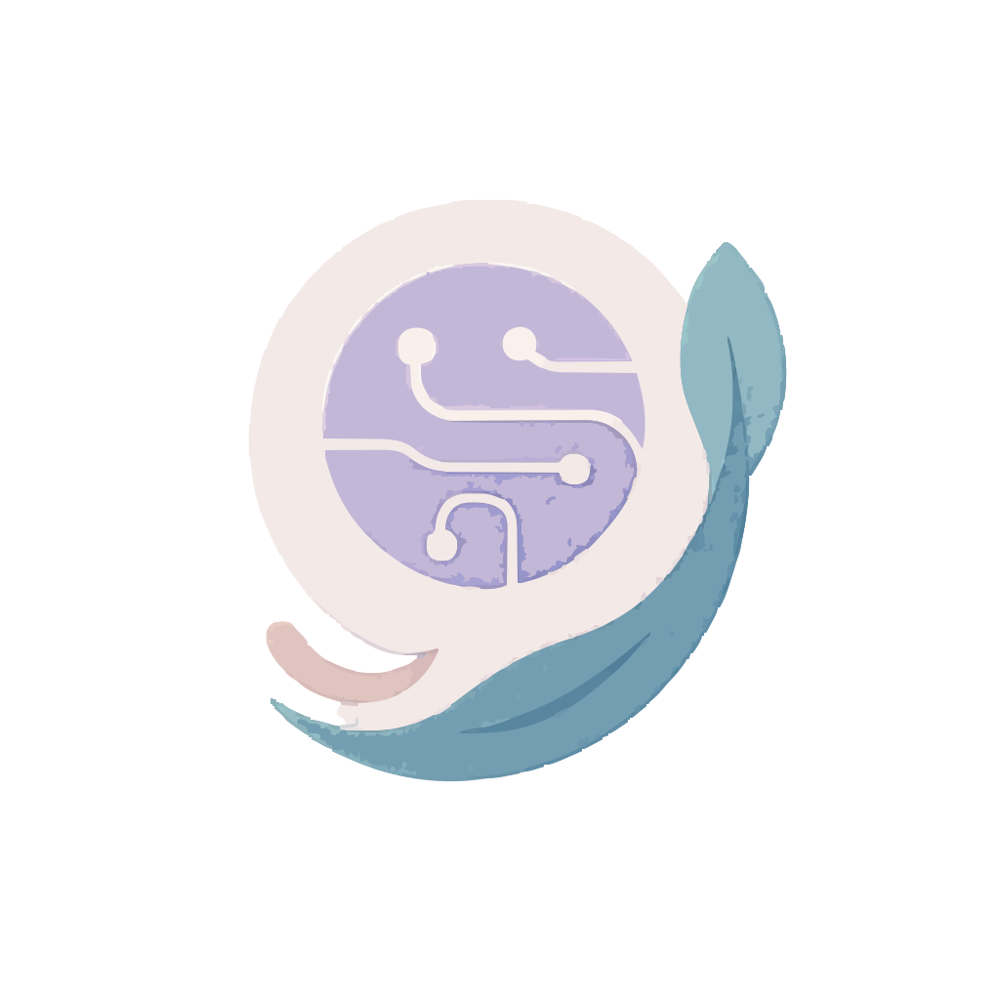
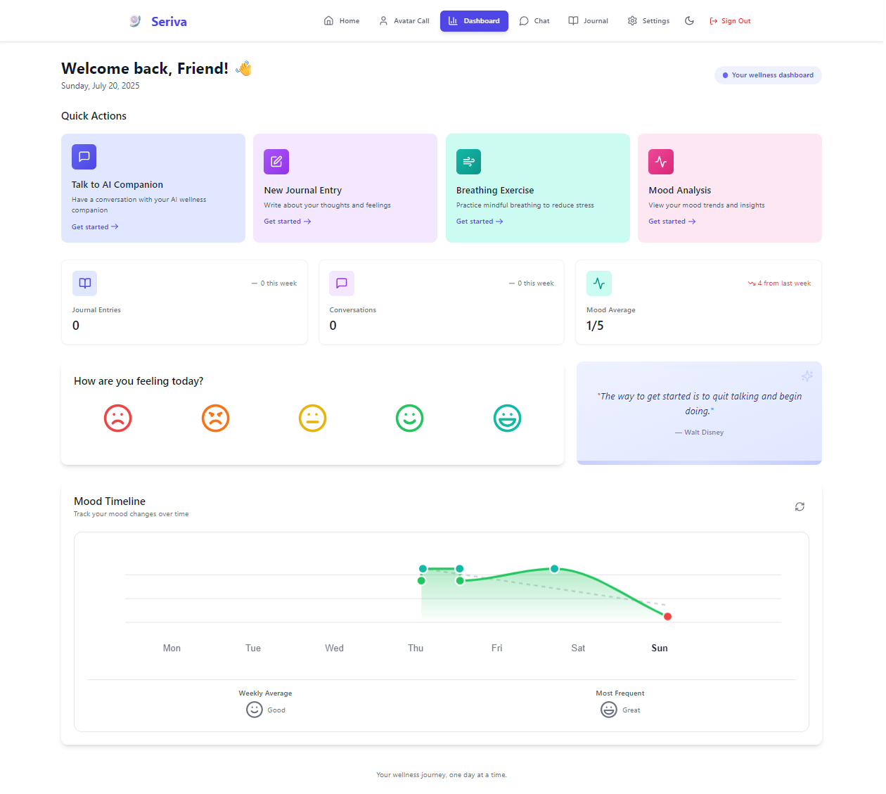
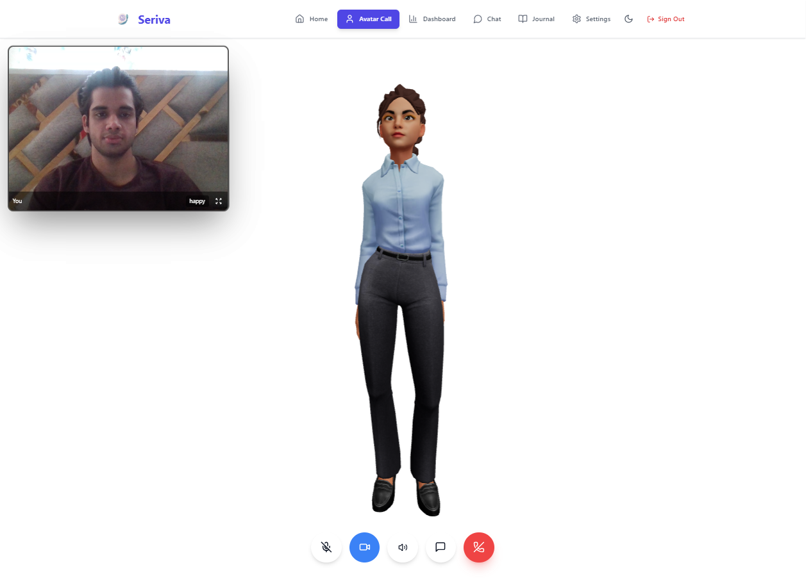
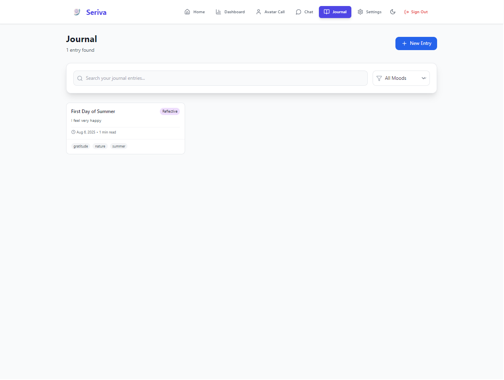

# 🤖 Seriva - AI-Powered Therapeutic Companion

<div align="center">
  
  
  **Your personal AI therapist and wellness companion**
  
  [](https://seriva-app.vercel.app)
  [](LICENSE)
  [](https://github.com/your-username/seriva-showcase/pulls)
</div>

---

## 📋 Table of Contents

- [✨ Introduction](#-introduction)
- [🚀 Live Demo](#-live-demo)
- [🎯 Core Features](#-core-features)
- [🛠️ Tech Stack](#️-tech-stack)
- [🏗️ Architecture Overview](#️-architecture-overview)
- [🎨 Screenshots](#-screenshots)
- [🌟 Key Innovations](#-key-innovations)
- [🔮 Future Roadmap](#-future-roadmap)
- [🤝 Contributing](#-contributing)
- [📄 License](#-license)
- [📧 Contact](#-contact)

---

## ✨ Introduction

**Seriva** is a cutting-edge AI-powered therapeutic companion that combines advanced artificial intelligence with evidence-based wellness practices. Born from the vision of making mental health support accessible and personalized, Seriva offers a unique blend of conversational AI therapy, mood tracking, journaling, and proactive wellness interventions.

### 🎯 The Problem We Solve

- **Accessibility**: Mental health support is expensive and often inaccessible
- **Availability**: Traditional therapy has limited availability and scheduling constraints
- **Personalization**: One-size-fits-all approaches don't work for everyone
- **Continuity**: Maintaining therapeutic progress between sessions is challenging

### 💡 Our Solution

Seriva provides 24/7 personalized therapeutic support through:
- **Intelligent Avatar Conversations** with lifelike AI therapist
- **Continuous Mood & Wellness Tracking** with predictive insights
- **Therapeutic Journaling** with AI-powered reflection prompts
- **Proactive Mental Health Interventions** based on behavioral patterns

---

## 🚀 Live Demo

**[🌐 Try Seriva Live](https://seriva.vercel.app)**

> *Experience the future of AI-powered mental health support*

### Quick Start Guide:
1. **Visit the app** - No signup required for demo
2. **Start a conversation** - Talk to Seriva about anything on your mind
3. **Explore journaling** - Try the AI-powered reflection prompts
4. **Track your mood** - See how your emotional patterns evolve

---

## 🎯 Core Features

### 🗣️ **Intelligent Avatar Conversations**
- **3D Animated Therapist**: Lifelike avatar with realistic facial expressions and gestures
- **Advanced Speech Recognition**: Seamless voice-to-text with real-time processing
- **Natural Text-to-Speech**: Human-like voice responses using Azure Cognitive Services
- **Therapeutic Dialogue**: AI trained on evidence-based therapeutic approaches
- **Persistent Memory**: Conversations build upon previous sessions for continuity

### 📊 **Advanced Mood Analytics**
- **Real-time Mood Tracking**: Intuitive mood logging with customizable scales
- **Predictive Insights**: AI-powered analysis of mood patterns and triggers
- **Visual Analytics**: Beautiful charts and trend analysis
- **Personalized Recommendations**: Tailored wellness suggestions based on your data

### ✍️ **Therapeutic Journaling**
- **AI-Powered Prompts**: Intelligent writing prompts based on your current state
- **Reflection Analysis**: AI helps identify patterns and insights in your writing
- **Secure Storage**: End-to-end encrypted journal entries
- **Export & Backup**: Full control over your personal data

### 🚨 **Proactive Wellness Engine**
- **Behavioral Pattern Detection**: AI monitors for signs of mental health changes
- **Intelligent Interventions**: Proactive suggestions and check-ins
- **Crisis Detection**: Safety protocols for emergency situations
- **Wellness Challenges**: Personalized goals and activities for mental health

### 🎭 **Advanced Gesture & Emotion Recognition**
- **Real-time Emotion Detection**: Computer vision analysis of facial expressions
- **Gesture Recognition**: Hand and body language interpretation
- **Adaptive Responses**: AI adjusts conversation style based on emotional cues
- **Multi-modal Input**: Voice, text, and visual cues for comprehensive understanding

---

## 🛠️ Tech Stack

### **Frontend**
| Technology | Purpose | Version |
|------------|---------|---------|
| **React 18** | Core UI Framework | `^18.2.0` |
| **Three.js** | 3D Avatar Rendering | `^0.158.0` |
| **Tailwind CSS** | Styling & Design System | `^3.3.0` |
| **Framer Motion** | Animations & Transitions | `^10.16.0` |
| **MediaPipe** | Gesture Recognition | `^0.10.8` |
| **Chart.js** | Data Visualization | `^4.4.0` |

### **Backend & AI**
| Technology | Purpose | Details |
|------------|---------|---------|
| **Node.js + Express** | API Server | RESTful API with middleware |
| **Groq API** | Primary LLM Provider | Llama 3.1 70B model |
| **OpenAI GPT-4** | Fallback LLM | Advanced reasoning tasks |
| **Anthropic Claude** | Secondary Fallback | Ethical AI responses |
| **Azure TTS** | Text-to-Speech | Neural voice synthesis |
| **Web Speech API** | Speech Recognition | Browser-native STT |

### **Database & Storage**
| Technology | Purpose | Implementation |
|------------|---------|----------------|
| **Firebase Firestore** | NoSQL Database | Real-time data synchronization |
| **Firebase Storage** | Media Storage | Images, audio, documents |
| **Firebase Auth** | Authentication | Secure user management |

### **Infrastructure & Deployment**
| Technology | Purpose | Platform |
|------------|---------|----------|
| **Vercel** | Frontend Hosting | Edge network deployment |
| **Render** | Backend Hosting | Scalable cloud platform |
| **GitHub Actions** | CI/CD Pipeline | Automated deployments |

---

## 🏗️ Architecture Overview

### **Emotion-Sync Pipeline**
Seriva's core innovation is the **Emotion-Sync Pipeline** - a sophisticated system that combines multiple AI models and data sources to create truly empathetic responses:

```
User Input → Emotion Detection → Context Analysis → Response Generation → Delivery Optimization
     ↓              ↓                ↓                    ↓                    ↓
Voice/Text    Facial/Gesture    Conversation      Multi-LLM         Avatar Animation
Recognition   Recognition       History          Orchestration      + Voice Synthesis
```

### **Multi-LLM Orchestration**
- **Primary**: Groq (Llama 3.1 70B) for fast, conversational responses
- **Fallback**: OpenAI GPT-4 for complex reasoning and analysis
- **Ethical Layer**: Anthropic Claude for safety and appropriateness checks
- **Smart Routing**: Automatic provider switching based on response quality and availability

### **Real-time Data Processing**
- **Streaming Responses**: WebSocket connections for real-time AI conversations
- **Predictive Caching**: Pre-computation of likely responses for faster interaction
- **Edge Computing**: Optimized delivery through global CDN network

---

## 🎨 Screenshots

<div align="center">

### 💬 Avatar Conversation Interface

*Real-time conversation with 3D animated therapist*

### 📊 Mood Analytics Dashboard  

*Comprehensive mood tracking and pattern analysis*

### ✍️ AI-Powered Journaling
  
*Intelligent writing prompts and reflection analysis*

### 📈 Wellness Insights

*Predictive analytics and personalized recommendations*

</div>

---

## 🌟 Key Innovations

### 🧠 **Therapeutic AI Engine**
- **Evidence-Based Responses**: AI trained on CBT, DBT, and mindfulness techniques
- **Adaptive Personality**: Seriva's personality adjusts to user preferences and needs
- **Crisis Recognition**: Advanced pattern detection for mental health emergencies
- **Therapeutic Continuity**: Session-to-session memory for long-term therapeutic relationships

### 🎭 **Multi-Modal Emotion Recognition**
- **Facial Expression Analysis**: Real-time emotion detection using computer vision
- **Voice Tone Analysis**: Emotional state detection from speech patterns  
- **Gesture Recognition**: Body language interpretation for deeper understanding
- **Contextual Awareness**: Combines all inputs for comprehensive emotional intelligence

### 🔄 **Proactive Wellness System**
- **Behavioral Pattern Learning**: AI learns user's unique mental health patterns
- **Predictive Interventions**: Proactive outreach during identified risk periods
- **Personalized Coping Strategies**: Custom wellness plans based on individual data
- **Preventive Care Focus**: Early intervention to prevent mental health crises

---

## 🔮 Future Roadmap

### **Phase 1: Enhanced AI Capabilities** *(Q3 2024)*
- [ ] Integration with GPT-4o for multi-modal understanding
- [ ] Advanced personality customization options
- [ ] Group therapy simulation capabilities
- [ ] Integration with wearable devices for biometric data

### **Phase 2: Expanded Wellness Features** *(Q4 2024)*
- [ ] Meditation and mindfulness guided sessions
- [ ] Integration with fitness and sleep tracking
- [ ] Family and couples therapy modules
- [ ] Professional therapist collaboration tools

### **Phase 3: Platform & Ecosystem** *(Q1 2025)*
- [ ] Mobile applications (iOS/Android)
- [ ] API for third-party integrations  
- [ ] White-label solutions for healthcare providers
- [ ] Research partnerships with universities

---

## 🤝 Contributing

We welcome contributions from the mental health, AI, and developer communities! 

### How to Get Involved:
- 🐛 **Report Issues**: Found a bug? Please open an issue
- 💡 **Feature Requests**: Have an idea? We'd love to hear it
- 📖 **Documentation**: Help improve our docs and guides
- 🧪 **Testing**: Help us test new features and provide feedback

> **Note**: This repository is a public showcase. The full source code is maintained in a private repository for proprietary reasons. For collaboration inquiries, please reach out directly.

---

## 📄 License

This project is licensed under the MIT License - see the [LICENSE](LICENSE) file for details.

---

## 📧 Contact

**Creator**: [Your Name]
- 🌐 **Portfolio**: [https://priyank-0401.github.io/priyankpahwa/](https://priyank-0401.github.io/priyankpahwa/)
- 💼 **LinkedIn**: [https://linkedin.com/in/your-profile](https://linkedin.com/in/priyankpahwa41)
- 📧 **Email**: [priyankpahwa41@gmail.com]
- 🐦 **Twitter**: [@your-handle]

**Project Links**:
- 🚀 **Live Demo**: [seriva-app.vercel.app](https://seriva.vercel.app)
<!-- - 📱 **Landing Page**: [seriva.ai](https://seriva.ai) *(Coming Soon)* -->

---

<div align="center">
  <h3>🌟 If Seriva has helped you or inspired your work, please consider giving it a star! 🌟</h3>
  
  **Made with ❤️ for mental health and AI innovation**
</div>
